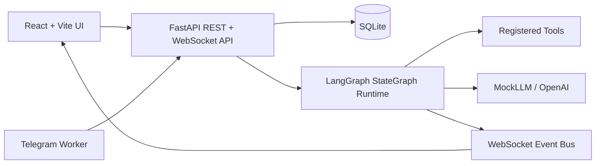

# Devinder AI Agent Studio

Devinder AI Agent Studio is a local-first AI Agent Orchestration Platform where users can create configurable agents, connect them into LangGraph workflows, run them, monitor execution, and interact through Telegram.

## Project Overview

Devinder AI Agent Studio is a local-first AI Agent Orchestration Platform where users can create configurable agents, connect them into LangGraph workflows, run them, monitor execution, and interact through Telegram.

## Requirement Mapping Table

| Challenge Requirement | Implementation |
| --- | --- |
| Agent CRUD | FastAPI APIs + React Agent page |
| Agent configuration | Prompt, role, model, tools, memory, guardrails, limits |
| Visual workflow builder | React Flow with WorkflowNode/WorkflowEdge persistence |
| 2 templates | Research → Write → Review, Customer Support Triage |
| Real runtime | LangGraph StateGraph + compiled.ainvoke |
| Async agent communication | AgentMessage persistence + WebSocket events |
| Message history | RunMonitor reloads persisted DB history |
| Telegram integration | telegram-worker with channel deduplication |
| Live monitoring | Logs, messages, tool calls, token usage, cost, metrics |
| Tests | pytest critical path tests, api security tests |
| Advanced Run Durability | SQLite NodeRun persistence, retries, and Guardrails |
| Advanced Memory | SQLite AgentMemory injection into prompts |
| Recurring Schedules | APScheduler background worker and CRUD endpoints |

## Architecture Diagram



## Tech Choices Justification

### Why FastAPI
FastAPI provides a fast, asynchronous backend with automatic OpenAPI docs, strong validation via Pydantic, and excellent developer ergonomics for building REST and WebSocket APIs.

### Why LangGraph
LangGraph enables real runtime graph execution, compiled workflow state, and node-level async transitions without manual orchestration logic. It is a good fit for multi-agent workflows and conditional branching.

### Why React + Vite
React gives us a responsive visual workflow UI, and Vite provides fast builds, hot reload, and a modern frontend developer experience.

### Why SQLite
SQLite is local-first, lightweight, and easy to seed/reset for demos. It keeps the stack simple while persisting runs, messages, logs, tool calls, and token usage.

### Why Telegram
Telegram is an optional channel for conversational workflow triggers. It works well for remote notifications and quick interactive demos without requiring a proprietary UI.

### Why MockLLM by default
MockLLM is enabled by default to make local execution deterministic, repeatable, and free of paid LLM dependencies.

## Setup Instructions

### Option 1: With Docker (Recommended)
```bash
cp .env.example .env
make reset-db
make dev
```

### Option 2: Native Local Setup (Without Docker)
1. Configure Environment:
```bash
cp .env.example .env
```
2. Start Backend:
```bash
cd backend
python -m venv venv
source venv/bin/activate
pip install -r requirements.txt
python -m app.db.reset_db
uvicorn app.main:app --host 0.0.0.0 --port 8000 --reload
```
3. Start Frontend (in a new terminal):
```bash
cd frontend
npm install
npm run dev
```

## Environment Variables

The application can be configured by creating a `.env` file from the example:
```bash
cp .env.example .env
```

**Common Variables:**
- `USE_MOCK_LLM=true`: Enables deterministic mock responses for local demos and tests.
- `OPENAI_API_KEY`: Required only when `USE_MOCK_LLM=false`.
- `OPENAI_MODEL`: OpenAI model used for real LLM mode, default `gpt-4o-mini`.
- `TELEGRAM_BOT_TOKEN`: Token from BotFather for Telegram integration.
- `DEFAULT_TELEGRAM_WORKFLOW_ID`: Workflow ID from a created workflow URL used by the Telegram bot.
- `DATABASE_URL`: SQLite database URL for the backend data store.
- `VITE_API_BASE_URL`: Frontend API base URL.
- `VITE_WS_BASE_URL`: Frontend WebSocket base URL.
- `SEARCH_PROVIDER=duckduckgo`: Use DuckDuckGo for real web search tool execution.
- `DUCKDUCKGO_MAX_RESULTS=5`: Maximum number of DuckDuckGo search results returned by the tool.

**Security / Advanced Variables:**
- `API_AUTH_ENABLED=true`: Enable global API Key authentication (recommended for production).
- `API_KEY=your_secret_key`: The required API key when `API_AUTH_ENABLED` is true. Include it in requests via the `X-API-Key` header. Frontend client will send this automatically if set.
- `APP_NAME`: Configures the FastAPI app title (defaults to "Devinder AI Agent Studio").
- `VITE_APP_NAME`: Configures the frontend sidebar header and browser tab title (defaults to "Devinder AI Agent Studio").
- `CORS_ALLOWED_ORIGINS`: Comma-separated list of allowed CORS origins (defaults securely to `http://localhost:3000`).

## LLM Modes

Devinder AI Agent Studio supports two LLM modes.

### 1. MockLLM mode, default

Used for deterministic local development and tests.

```env
USE_MOCK_LLM=true
```

This mode requires no API key.

### 2. Real OpenAI mode

Used for live demo with a real LLM.

```env
USE_MOCK_LLM=false
OPENAI_API_KEY=your_openai_key
OPENAI_MODEL=gpt-4o-mini
```

In this mode, agent nodes call the OpenAI API through the `OpenAIClient`. Token usage returned by OpenAI is persisted in `token_usages` and shown in the Run Monitor.

Never commit `.env` or API keys. `.env` is ignored by `.gitignore`.

## Tool Execution

Tools are executable backend capabilities invoked by the LangGraph runtime.

Agent nodes support true LLM-directed tool calling: the runtime sends the agent's configured tool schemas to MockLLM/OpenAI, the model may request one or more tool calls, the runtime executes only authorized requested tools, sends each result back to the model, and persists the final agent response. This is separate from explicit workflow `TOOL` nodes, which are graph nodes that always execute when the workflow reaches them.

Included tools:
- `duckduckgo_search_tool`: real web search using DuckDuckGo, no API key required.
- `calculator_tool`: safely evaluates basic arithmetic.
- `knowledge_base_tool`: searches local knowledge base content.
- `summarizer`: summarizes runtime text.
- `draft_response_tool`: drafts final response text.

Tool calls are persisted in the `tool_calls` table and streamed to the Run Monitor.

Guardrails apply to both explicit `TOOL` nodes and LLM-requested tool calls. The runtime blocks unknown tools, tools not present in the agent's `tools_json`, tools excluded by `guardrails_json.allowed_tools`, blocked keywords in tool arguments, and max tool-call budget violations before execution.

DuckDuckGo can fail if the machine has no internet access or if DuckDuckGo rate limits requests. Such failures are captured as ToolCall errors and shown in the Run Monitor. Tests monkeypatch DuckDuckGo and OpenAI tool-calling responses to avoid network dependency.

## Demo Script

1. Start the app:
   ```bash
   make dev
   ```
2. Open the UI at `http://localhost:3000`.
3. Confirm the 8 agents are available.
4. Manage persistent Memories via the "Memory" tab.
5. Create a workflow from a template or build from scratch.
6. Configure periodic Workflow runs using the "Schedules" tab.
7. Run the workflow manually from the builder.
8. Open the Run Monitor.
9. Verify logs, messages, tool calls, token usage, cancel/resume operations, and metrics are visible.
10. Refresh and confirm persisted history reloads.
11. Optional: demonstrate Telegram by sending a message to the bot (supports deduplication).

## API Docs

FastAPI Swagger UI is available at:
`http://localhost:8000/docs`

## API Response Standard

All REST responses use a consistent envelope:

```json
{
  "success": true,
  "message": "Operation completed",
  "data": {},
  "correlation_id": "FRONT-...",
  "timestamp": "..."
}
```

Validation and server errors use:

```json
{
  "success": false,
  "message": "Validation failed",
  "errors": [],
  "correlation_id": "BACK-...",
  "timestamp": "..."
}
```

## Pagination

List endpoints support `page` and `size` query parameters and return pagination metadata:

```json
{
  "data": {
    "content": [],
    "pagination": {
      "page": 1,
      "size": 20,
      "total_elements": 100,
      "total_pages": 5,
      "has_next": true,
      "has_previous": false
    }
  }
}
```

## Correlation IDs

The frontend sends `X-Correlation-ID` on each API request. If missing, the backend generates one with a `BACK-` prefix. The same ID is returned in the response header/body and included in structured logs. Run Monitor WebSocket connections also pass the correlation ID as a query parameter, and runtime events include `correlation_id` and `task_id`.

## Structured Logs

Log format:

```text
[YYYY-MM-DD HH:mm:ss.SSS][corr=...][run=...][task=...][file=...:line][level=INFO] message
```

## Config Endpoint

Runtime configuration is available without secrets:

```bash
curl http://localhost:8000/api/config
```

Example response:

```json
{
  "llm_mode": "mock",
  "model": "gpt-4o-mini",
  "search_provider": "duckduckgo",
  "telegram_configured": false,
  "database": "sqlite"
}
```

## Enum Endpoint

Backend enum values are exposed without secrets through the standard response envelope:

```bash
curl http://localhost:8000/api/enums
```

The response includes node types, run statuses, edge conditions, WebSocket event types, and error codes.

## WebSocket Resume

Run monitor WebSocket supports:

```text
/ws/runs/{run_id}?correlation_id=FRONT-...&last_event_id=123
```

When `last_event_id` is provided, the backend replays missed `RunLog` events with `event_id > last_event_id` before streaming live events. Runtime events use a per-run numeric `event_sequence` as the WebSocket `event_id`.

## Code Quality Conventions

- Frontend API paths, app routes, WebSocket event names, workflow statuses, node types, and shared UI messages are centralized under `frontend/src/constants`.
- Backend node types, run statuses, edge conditions, WebSocket event types, error codes, and common response messages use enums/constants in `backend/app/core/constants.py`.
- REST responses use the standard success/error envelope with `correlation_id` and `timestamp`.
- Structured logs include timestamp, correlation ID, run ID, task ID, file, line, level, and message.
- Repeated runtime log messages live in `backend/app/core/log_messages.py`.

## Workflow Builder UX

- The Run button is disabled until the workflow graph is loaded, at least one node exists, and input text is provided.
- Save and Run are disabled during loading and error states.
- Empty graphs show an explicit empty state instead of a blank canvas.
- Tool, agent, condition, and end nodes can be added from the builder toolbar.
- Agent nodes include an agent picker, tool nodes include schema-driven config forms with Advanced JSON fallback, and condition edges include a visual condition editor.
- Graph saves preserve node metadata such as `node_type`, `agent_id`, `tool_name`, `config_json`, positions, and edge condition fields.

## Tool Node Configuration

Tool nodes can be added from Workflow Builder. Each tool node stores:
- `tool_name`
- `config_json`
- position

Supported tools:
- `duckduckgo_search_tool`
- `calculator_tool`
- `knowledge_base_tool`
- `summarizer_tool`
- `draft_response_tool`

The builder includes schema-driven fields for common tools and an Advanced JSON fallback. Saved configs are resolved by the runtime into actual tool inputs, for example calculator expressions, manual search queries, or DuckDuckGo `max_results`.

## Test Strategy

API tests and runtime tests are separated:
- API tests verify route behavior and run creation.
- Runtime tests create a `WorkflowRun` directly and execute `RuntimeService`.

This avoids duplicate execution of the same run during tests and keeps persistence assertions deterministic.

## How to Extend

### How to add a new tool
1. Create a new tool class in `backend/app/tools/` extending `ToolInterface`.
2. Implement `name`, `description`, `input_schema`, and `async execute(input_data)`.
3. Register the tool in `backend/app/tools/core_tools.py` under `ALL_TOOLS`.

### How to add a new workflow template
1. Open `backend/app/api/templates.py`.
2. Add a new template entry with `nodes` and `edges`.
3. Use `condition_type` for branching logic.
4. Restart the backend if necessary.

### How to add a new messaging channel
1. Create a worker module under `backend/app/channels/`.
2. Connect the channel client (e.g. Telegram, Slack, Discord).
3. Trigger runs using `RuntimeService.execute_run(db, run_id, workflow_id, input_data)`.
4. Register the new service in `docker-compose.yml` if needed.

## Optional Docs Folder

Good-to-have docs are included in the `docs/` folder:
- `docs/architecture.md`
- `docs/demo-script.md`
- `docs/adding-tools.md`
- `docs/adding-templates.md`
- `docs/adding-channels.md`

## Known Tradeoffs

- MockLLM is the default for local deterministic demos.
- MockLLM is retained for deterministic tests and offline demos. Real OpenAI mode is implemented and can be enabled with `USE_MOCK_LLM=false`.
- SQLite is used for simplicity and local-first deployment.
- Telegram worker is optional and gracefully disabled if environment vars are missing.

## Future Extensions

- Additional LLM providers behind the `BaseLLMClient` abstraction.
- More production-grade auth and tenant isolation.
- Scheduled workflow execution (Completed using APScheduler worker).
- API Key Authentication and rate limits (Completed `APIAuthMiddleware`).
- Guardrails configuration for input/output sanitization (Completed).

## Final Verification

Run:

```bash
cp .env.example .env
make clean
make reset-db
make migrate
make test
cd frontend && npm test
cd frontend && npm run build
docker compose build
docker compose up -d
docker compose ps
```

Verify:
- Frontend: http://localhost:3000
- Backend API docs: http://localhost:8000/docs
- Agents API returns 8 agents
- Templates API returns 2 templates
- Create workflow from template
- Run workflow
- Run Monitor shows logs/messages/tool calls/token usage
- Refresh Run Monitor and persisted history remains

Curl checks:

```bash
curl http://localhost:8000/api/agents
curl http://localhost:8000/api/templates
```

## Final Production Verification

- Runtime duplicate event check: PASS
- `/health` envelope: PASS
- `/ready` envelope: PASS
- `RUN_LOG` constants cleanup: PASS
- `make test`: PASS
- frontend `npm test`: PASS
- frontend `npm run build`: PASS
- `docker compose build`: PASS
- `docker compose up -d`: PASS
- final package clean: PASS

See `docs/final-verification-proof.md` for the command-by-command proof report.

## EasyPanel Deployment

Recommended services:
1. `backend-api`
2. `frontend`
3. `scheduler-worker`
4. `telegram-worker`

For quick demo deployment, SQLite is supported using a `/app/data` persistent volume. See [docs/easypanel-deployment.md](docs/easypanel-deployment.md) for step-by-step setup details.

> **Warning:** SQLite is acceptable for demo/single-user deployment. With multiple workers, avoid heavy parallel workflows because SQLite can lock under concurrent writes. For serious production, use PostgreSQL later.

## Evaluation Mapping

| Evaluation Area | Implementation |
|---|---|
| Working end-to-end demo | Template -> Builder -> LangGraph run -> Run Monitor -> Telegram optional |
| Architecture/code quality | FastAPI service layer, LangGraph runtime, SQLAlchemy persistence, typed schemas |
| UI/UX/configurability | Agent CRUD, config fields, React Flow builder, templates, monitor |
| Documentation | README, docs folder, setup, extension guides |

| Requirement | Status |
|---|---|
| Agent CRUD | Implemented |
| Agent schedules/channels config | Exposed in backend and Agent UI as JSON config |
| Visual workflow builder | React Flow + persisted graph |
| 2 templates | Implemented |
| External channel | Telegram worker |
| Live monitoring | WebSocket + RunMonitor |
| Token/cost tracking | TokenUsage persisted and displayed |
| Tests | pytest critical path tests |

## Key Architecture Policies & Features

### 1. Metadata APIs
To avoid frontend hardcoding of options, the backend exposes dynamic metadata endpoints:
- `GET /api/metadata/models`: Lists provider-supported models (such as `gpt-4o-mini` and `mock-llm`).
- `GET /api/metadata/tools`: Lists canonical tools directly from the backend tool registry.
- `GET /api/metadata/channels`: Verifies credentials status for channels like Telegram bot connection.

### 2. Tool Aliasing Policy
The agent studio maps legacy or shorthand names to canonical names using the tool alias resolver. For example:
- `draft_generator` and `draft_generator_tool` resolve to `draft_response_tool`.
- `web_search` and `search` resolve to `duckduckgo_search_tool`.
OpenAI function schemas are generated using canonical names, and guardrail validations check against canonical resolved names to prevent false unauthorized failures. Both the requested name and canonical name are persisted.

### 3. Blocked Tool-Call Persistence
If the guardrail blocks an LLM tool request:
- A database record is saved in the `tool_calls` table with a status of `FAILED`.
- The `error_message` records the guardrail violation reason.
- `TOOL_CALL_FAILED` and `GUARDRAIL_VIOLATION` events are broadcasted, showing the blocked request immediately on the Run Monitor timeline.

### 4. RunMonitor Layout Behavior
The Run Monitor layout is designed to keep all execution panels fully visible:
- **Responsive Layout**: Adapts gracefully to small viewports.
- **Scrollable Cards**: Messages, Tool Calls, and Logs panels have independent vertical scrolling via `max-h-[450px]` and `overflow-y-auto`.
- **Wide Scrollable Tables**: Tables (Timeline, Token Usage) use horizontal scrollbars (`overflow-x-auto`) to prevent layout clipping.

## Final Verdict

Devinder AI Agent Studio is ready as a local-first containerized platform with configurable agents, visual workflows, live monitoring, persistent history, and optional Telegram integration.
