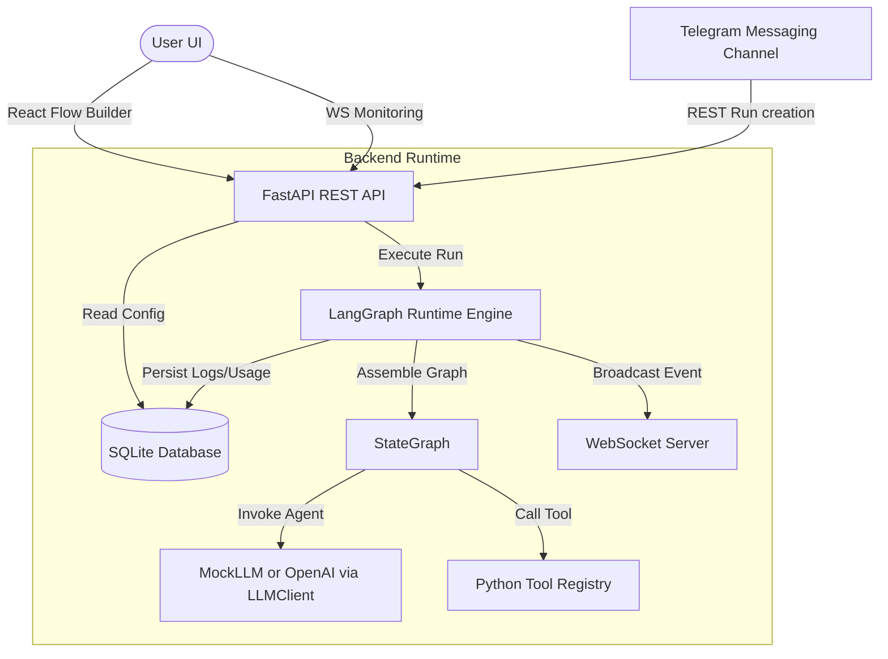

# Architecture & Technology Choices

This document details the high-level architecture design of **Yuno Agent Studio**.

## Architecture Flow



## Why LangGraph?
LangGraph is a library for building stateful, multi-actor applications with LLMs. Unlike classic DAG runners, it supports cyclical graph definitions. This is critical for agentic workflows where output from a Reviewer Agent needs to loop back to a Writer Agent with feedback coordinates.

## Why FastAPI?
FastAPI is used as the API gateway. It natively supports async WebSocket connections and provides fast, type-safe requests validated with Pydantic.

## Why React + Vite?
React's component lifecycle is optimal for visual tools like React Flow, which is used to render the workflow graph. Vite ensures rapid compilation and instantaneous local HMR.

## Database Schema Summary
The persistence layer utilizes SQLite for local-first zero-config operation:
- `agents`: Defines prompts, configs, model choice, limits.
- `workflows`: Defines user workflow metadata.
- `workflow_nodes`: Graph node coordinates and config.
- `workflow_edges`: Standard and conditional graph paths.
- `workflow_runs`: High-level run statuses (QUEUED, RUNNING, COMPLETED, FAILED).
- `agent_messages`: Persists `AGENT_OUTPUT` and `TASK_HANDOFF` messages.
- `tool_calls`: Tracks inputs, outputs, statuses, and performance of tools.
- `token_usages`: Records prompt, completion, total tokens, and estimated cost per node.
- `run_logs`: High-level event logs.
- `run_logs.event_sequence`: Per-run numeric event ID used for WebSocket resume/replay.

## LLM Provider Boundary

The default MVP path uses `MockLLM` for deterministic local execution and reliable tests. Real OpenAI mode is also implemented: set `USE_MOCK_LLM=false`, `OPENAI_API_KEY`, and `OPENAI_MODEL` to make agent nodes call OpenAI through `OpenAIClient`.

The runtime calls an `LLMClient` abstraction, so future Ollama/Anthropic clients can be added behind that boundary without changing workflow orchestration, persistence, or monitoring code. The LLM interface supports OpenAI-compatible tool schemas and returns parsed `tool_calls` so AGENT nodes can let the model choose tools.

## Tool Execution Boundary

Runtime tools are registered backend capabilities. `duckduckgo_search_tool` performs real DuckDuckGo web search during local demo/runtime usage, while tests monkeypatch the registry with deterministic fake search results so CI and `make test` do not depend on internet access, rate limits, or DuckDuckGo availability.

Tool inputs, outputs, status, and errors are persisted in `tool_calls`; failures also produce run events so the Run Monitor can display them clearly.

Tool nodes store `tool_name`, `config_json`, and position. The runtime resolves `config_json` into concrete tool inputs, such as calculator `expression`, DuckDuckGo `query_source`, and DuckDuckGo `max_results`.

AGENT nodes support LLM-directed tool calling in addition to explicit workflow TOOL nodes. The runtime sends the configured tool schemas to the model, executes requested and authorized tools, appends tool result messages back into the LLM conversation, and persists the final agent output. Guardrails are enforced before any LLM-requested tool executes.

## API Response, Correlation, and Logging

All REST endpoints return a standard envelope with `success`, `message`, `data` or `errors`, `correlation_id`, and `timestamp`. List endpoints use `page` and `size` query parameters and return `content` plus pagination metadata.

The backend accepts `X-Correlation-ID` from clients and generates a `BACK-` ID when absent. The same ID is returned in response headers and bodies, included in structured logs, and propagated to WebSocket runtime events with a `task_id`.

Run Monitor WebSocket resume is supported with `/ws/runs/{run_id}?correlation_id=FRONT-...&last_event_id=123`. Missed `RunLog` events with `event_id > last_event_id` are replayed before live streaming resumes.

Structured logs use:

```text
[YYYY-MM-DD HH:mm:ss.SSS][corr=...][run=...][task=...][file=...:line][level=INFO] message
```
